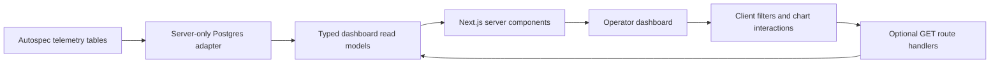

# Autospec GUI Telemetry Dashboard Design

## Goal

Create a simple, read-only Next.js web application that helps the autospec operator inspect telemetry collected in the configured Postgres database.

## Background

Autospec now records telemetry in Postgres. The first companion application should prove the autonomous pipeline can create a separate product repository, read the telemetry schema safely, and present useful operational data without adding write paths or complex administration features.

## Team Personality

Selected team: Frontend/product telemetry team.

Roles: product engineer, frontend developer, backend/API developer, database engineer, QA engineer, accessibility reviewer.

Why this fits: the first deliverable is an operator-facing dashboard with a thin server-side data layer over an existing Postgres source. The team should optimize for clear summaries, dependable read-only queries, and small UI slices that autonomous implementers can ship independently.

Risks to notice: accidental database writes, leaking connection details to the browser, dashboards that hide empty/error states, misleading aggregate labels, slow queries over unbounded telemetry tables, and UI controls that are hard to validate automatically.

Review counter-team: reliability and data-integrity review.

Roles: SRE, security reviewer, database reviewer, test engineer.

Challenge assumptions: every query is read-only, every metric explains its time window, every empty state distinguishes "no data" from "query failed", and every UI claim has an integration or smoke proof against a real Postgres instance.

## Architecture

Use Next.js App Router with TypeScript. Dashboard pages render through server components that call a small server-only telemetry data access layer. Browser-side code is limited to filters and chart interactions that do not need direct database access.

Initial file boundaries:

- `app/page.tsx` renders the overview dashboard.
- `app/runs/page.tsx` renders a run list with filters.
- `app/issues/page.tsx` renders issue and PR throughput views.
- `src/server/config.ts` validates server-only environment variables.
- `src/server/db.ts` owns the Postgres connection pool.
- `src/server/telemetry.ts` exposes typed read models for dashboard queries.
- `src/components/*` contains reusable visual components.

## Telemetry Scope

The first dashboard should show:

- Run counts by status over a selected time window.
- Recent autospec runs with start time, end time, duration, status, repository, and branch.
- Issue throughput: created, classified, implemented, merged, failed, and paused counts.
- PR/CI health: open PRs, merged PRs, failed checks, pending checks, and advisory-check status when available.
- Agent activity: phase, model tier, issue number, elapsed time, and terminal outcome when available.
- Error summary: grouped failure messages with count, latest occurrence, run link, and affected repository.

Do not build mutation controls, retry buttons, admin merge controls, or telemetry ingestion in this repository.

## Data Model Assumptions

The telemetry database already exists and is configured outside this app. The app reads it through `AUTOSPEC_TELEMETRY_DATABASE_URL` and optionally `AUTOSPEC_TELEMETRY_SCHEMA`.

Implementation must discover the actual table names and columns before coding query functions. If the telemetry schema is still evolving, add a narrow adapter layer that maps current tables to stable dashboard read models instead of spreading raw table names through UI components.

Queries must be read-only. Prefer a read-only database user. The app must fail startup or show a clear configuration error if the database URL is missing.

## UI Design

The first screen is the dashboard itself, not a marketing page. Use a quiet operational interface with dense but readable tables, small summary panels, explicit time windows, and predictable navigation.

Primary navigation:

- Overview
- Runs
- Issues
- Pull Requests
- Errors

Use accessible semantic HTML, keyboard-reachable filters, readable font sizes, and responsive layouts that keep tables usable on narrow screens. Avoid decorative cards-within-cards; repeated metric panels may use simple cards with clear spacing.

## API Shape

Server components may call the data layer directly. Route handlers are only needed for interactive client-side refreshes or filters. If route handlers are added, define `GET` handlers under `app/api/**/route.ts` and return typed JSON with explicit error shapes.

Environment variables:

- `AUTOSPEC_TELEMETRY_DATABASE_URL`: required server-only Postgres connection string.
- `AUTOSPEC_TELEMETRY_SCHEMA`: optional schema name, default `public`.
- `AUTOSPEC_GUI_READ_ONLY`: optional guard, default `1`; when set to anything else, validation should fail until a future spec authorizes writes.

## Error Handling

Configuration errors should render a clear server-side error panel that names the missing variable without printing secrets. Query failures should render a non-destructive error state for the affected widget and should not blank the full page unless the shared database connection cannot be initialized.

Empty states must say which data set and time window had no rows. Loading states must not cause layout shift.

## Testing and Validation

Use TDD for implementation issues. Unit tests may cover pure formatting and adapter logic. Integration tests for database reads must use a real Postgres instance loaded with small fixture rows. Do not mock database behavior for integration or smoke tests.

Required validation layers:

- `npm run typecheck`
- `npm run build`
- server data-layer tests against Postgres fixtures
- Playwright smoke test against a running app and real fixture database
- accessibility checks for navigation, filters, tables, and error states

Autospec QA revalidation must verify text inputs, date filters, dropdowns, buttons, API effects, accessibility, responsive behavior, negative paths, console/network error gates, data lifecycle proof, and artifact freshness.

## Mermaid

## Acceptance Criteria

- The repository contains a Next.js App Router scaffold with TypeScript.
- The repository contains this tracked design spec under `docs/specs/`.
- The README explains the repo purpose and local development entry point.
- `AGENTS.md` defines autonomous implementation guardrails for read-only telemetry work.
- `scripts/validate.sh` passes on a clean checkout.
- No committed file contains secrets or placeholder implementation text.

## Initial Issue Decomposition Guidance

Autospec autonomous should split implementation into small issues in this order:

1. Validate environment configuration and create the server-only Postgres connection module.
2. Inspect the telemetry schema and create typed read models for overview metrics.
3. Build the overview dashboard with fixture-backed integration tests.
4. Add runs and issue throughput pages with filters.
5. Add PR/CI health and error summary views.
6. Add Playwright smoke coverage and accessibility checks.
7. Update README with final setup, fixture, and validation commands.

Each issue should carry one primary smoke command and should avoid touching more than three logical units.
